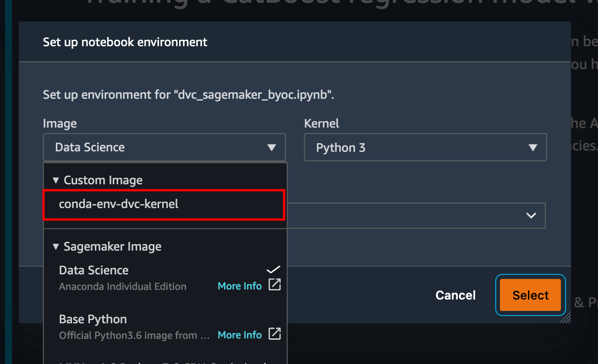

## Conda Environments as Kernels

This tutorial explains how to create a custom image for Amazon SageMaker Studio that has DVC already installed.
The advantage of creating an image and make it available to all SageMaker Studio users is that it creates a consistent environment for the SageMake Studio users, which they could also run locally.

This tutorial is heavily inspired by [this example](https://github.com/aws-samples/sagemaker-studio-custom-image-samples/tree/main/examples/conda-env-kernel-image).
Further information about custom images for SageMaker Studio can be found [here](https://docs.aws.amazon.com/sagemaker/latest/dg/studio-byoi.html)

## Prerequisite

* A Cloud9 environment with enough permissions

## Overview

This custom image sample demonstrates how to create a custom Conda environment in a Docker image and use it as a custom kernel in SageMaker Studio.

The Conda environment must have the appropriate kernel package installed, for e.g., `ipykernel` for a Python kernel.
This example creates a Conda environment called `dvc` with a few Python packages (see [environment.yml](environment.yml)) and the `ipykernel`.
SageMaker Studio will automatically recognize this Conda environment as a kernel named `conda-env-dvc-py`.

### Clone the GitHub repository 
```bash
git clone https://github.com/aws-samples/amazon-sagemaker-experiments-dvc-demo
```

### Resize Cloud9

```bash
cd ~/environment/amazon-sagemaker-experiments-dvc-demo/sagemaker-studio-dvc-image/
./resize-cloud9.sh 20
```

## Prepare environment

Set some basic environment variables

```bash
sudo yum install jq -y
export REGION=$(curl -s 169.254.169.254/latest/dynamic/instance-identity/document | jq -r '.region')
echo "export REGION=${REGION}" | tee -a ~/.bash_profile

export ACCOUNT_ID=$(aws sts get-caller-identity | jq -r '.Account')
echo "export ACCOUNT_ID=${ACCOUNT_ID}" | tee -a ~/.bash_profile

export IMAGE_NAME=conda-env-dvc-kernel
echo "export IMAGE_NAME=${IMAGE_NAME}" | tee -a ~/.bash_profile
```

Build the Docker image and push to Amazon ECR.

```bash
# Login to ECR
aws --region ${REGION} ecr get-login-password | docker login --username AWS --password-stdin ${ACCOUNT_ID}.dkr.ecr.${REGION}.amazonaws.com/smstudio-custom

# Create the ECR repository
aws --region ${REGION} ecr create-repository --repository-name smstudio-custom

# Build the image - it might take a few minutes to complete this step
docker build . -t ${IMAGE_NAME} -t ${ACCOUNT_ID}.dkr.ecr.${REGION}.amazonaws.com/smstudio-custom:${IMAGE_NAME}
# Push the image to ECR
docker push ${ACCOUNT_ID}.dkr.ecr.${REGION}.amazonaws.com/smstudio-custom:${IMAGE_NAME}
```

Prepare the environment for the CDK deployment.

Step 1: Navigate to the `cdk` directory:

```bash
cd ~/environment/amazon-sagemaker-experiments-dvc-demo/sagemaker-studio-dvc-image/cdk
```

Step 2: Create a virtual environment:

```bash
python3 -m venv .cdk-venv
```

Step 3: Activate the virtual environment after the init process completes, and the virtual environment is created:

```bash
source .cdk-venv/bin/activate
```

Step 4: Install the required dependencies:

```bash
pip3 install --upgrade pip
pip3 install -r requirements.txt
```

### Create a new SageMaker Studio
( Skip to [Update an existing SageMaker Studio](#update-an-existing-sagemaker-studio) if you have already an existing SageMaker Studio domain)

Step 5: deploy CDK (CDK will deploy a stack named: `sagemakerStudioCDK` which you can verify in `CloudFormation`)

```bash
cdk deploy --require-approval never
```

CDK will create the following resources via` CloudFormation`:
* provisions a new SageMaker Studio domain
* creates and attaches a SageMaker execution role, i.e., `RoleForSagemakerStudioUsers` with the right permissions to the SageMaker Studio domain
* creates a SageMaker Image and a SageMaker Image Version from the docker image `conda-env-dvc-kernel` we have created earlier
* creates an AppImageConfig which specify how the kernel gateway should be configured
* provision a SageMaker Studio user, i.e., `data-scientist-dvc`, with the correct SageMaker execution role and makes available the custom SageMaker Studio image available to it

### Update an existing SageMaker Studio

If you have an existing SageMaker Studio environment, we need to first retrieve the exising SageMaker Studio domain ID, deploy a "reduced" version of the CDK stack, and update the SageMaker Studio domain configuration.

Step 5: Set the `DOMAIN_ID` environment variable with your domain ID and save to your `bash_profile`.

```bash
export DOMAIN_ID=$(aws sagemaker list-domains | jq -r '.Domains[0].DomainId')
echo "export DOMAIN_ID=${DOMAIN_ID}" | tee -a ~/.bash_profile
```

Step 6: deploy CDK (by setting the `DOMAIN_ID` environment variable, CDK will deploy a stack named: `sagemakerUserCDK` which you can verify on `CloudFormation`)

```bash
cdk deploy --require-approval never
```

CDK will create the following resources via` CloudFormation`:
* creates and attaches a SageMaker execution role, i.e., `RoleForSagemakerStudioUsers` with the right permissions to your existing SageMaker Studio domain
* creates a SageMaker Image and a SageMaker Image Version from the docker image `conda-env-dvc-kernel` we have created earlier
* creates an AppImageConfig which specify how the kernel gateway should be configured
* provision a SageMaker Studio user, i.e., `data-scientist-dvc`, with the correct SageMaker execution role and makes available the custom SageMaker Studio image available to it

Step 7: Update the SageMaker Studio domain configuration

```bash
# inject your DOMAIN_ID into the configuration file
sed -i 's/<your-sagemaker-studio-domain-id>/'"$DOMAIN_ID"'/' ../update-domain-input.json

# update the sagemaker studio domain
aws --region ${REGION} sagemaker update-domain --cli-input-json file://../update-domain-input.json
```

Open the newly created SageMaker Studio user, i.e., `data-scientist-dvc`.

### Execute the lab

In the SageMaker Studio domain, launch `Studio` for the `data-scientist-dvc`.
Open a terminal and clone the repository

```bash
git clone https://github.com/aws-samples/amazon-sagemaker-experiments-dvc-demo
```

and open the [dvc_sagemaker_byoc.ipynb](../dvc_sagemaker_byoc.ipynb) notebook.

When prompted, ensure that you select the Custom Image `conda-env-dvc-kernel` as shown below



### Cleanup

Before removing all resources created, you need to make sure that all Apps are deleted from the `data-scientist-dvc` user, i.e. all `KernelGateway` apps, as well as the default `JupiterServer`.

Once done, you can destroy the CDK stack by running

```bash
cdk destroy
```

In case you started off from an existing domain, please also execute the following command:

```bash
# inject your DOMAIN_ID into the configuration file
sed -i 's/<your-sagemaker-studio-domain-id>/'"$DOMAIN_ID"'/' ../update-domain-no-custom-images.json

# update the sagemaker studio domain
aws --region ${REGION} sagemaker update-domain --cli-input-json file://../update-domain-no-custom-images.json
```